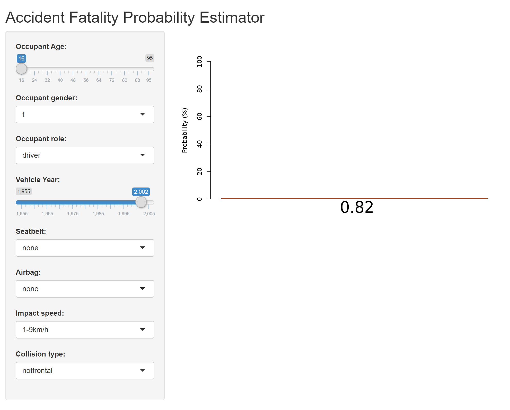

# Azure Functions for R with Custom Handlers

This repository demonstrates using Azure Functions and the Custom Handlers feature to create serverless services in the R language, to accompany [this blog post](https://blog.revolutionanalytics.com/2020/12/azure-functions-with-r.html).

## Pre-Requisites

1. You will need an Azure Subscription to run this example. If you don't have an Azure Subscription, you [can get one for free with $200 in Azure credits here](https://azure.microsoft.com/free/?WT.mc_id=javascript-10496-davidsmi).

2. You will need a local machine on which to run Azure CLI commands, and run the Shiny application. I have tested this with WSL2 and Ubuntu 20, but it should also work with native Windows, Linux, Mac, or indeed any platform that runs R and the Azure CLI.

3. Make sure the Azure CLI, Azure Functions Core Tools, and Docker are installed on your local machine [as described here](https://docs.microsoft.com/en-us/azure/azure-functions/functions-create-function-linux-custom-image?pivots=programming-language-other&tabs=bash%2Cportal&WT.mc_id=javascript-10496-davidsmi#configure-your-local-environment).

4. Make sure R is installed on your local machine, along with the "shiny" package. I've tested using R 3.6.3 and R 4.0.2, but any recent version of R should work. You may also want to install the "caret" and "plumber" packages if you want to test the Function locally.

5. You will also need a Docker ID for use with [Docker Hub](https://hub.docker.com/). (You _could_ use another container registry like Azure Container Registry, but I don't cover the details of that here.)

## Test the function locally

Thanks to the Azure Functions Core Tools, you can test running your function on your local machine, without deploying anything to Azure at all. 

I will show Azure CLI commands using `bash`, but you can adapt this to any shell.

1. Clone this repository to your local machine, with `git clone <url-of-this-repo>`.

2. cd to the downloaded repository

```bash
cd R-custom-handler
```

3. Launch R on your local machine, and verify that the `plumber`, `caret` and `shiny` packages are installed (or install them if needed).

```R
> require(caret)
Loading required package: caret
Loading required package: lattice
Loading required package: ggplot2
> require(plumber)
Loading required package: plumber
> library(shiny)
> q()
```

4. Use the `func start` CLI command to launch the function on your local machine:

```bash
func start --custom
```

5. Visit http://localhost:7071/api/msg?msg=local to test the local installation with an included "hello world" Function. You should see something like this in the browser:

```
{"msg":["The message is: 'local'"]}
```

## Deploy the Function to Azure

This process largely follows that of ["Create a function on Linux using a custom container"](https://docs.microsoft.com/en-us/azure/azure-functions/functions-create-function-linux-custom-image?pivots=programming-language-other&tabs=bash%2Cportal&WT.mc_id=javascript-10496-davidsmi) on Microsoft Docs, but using the files in this repository.

Log into Azure:

`az login`

Choose an Azure region to host your function. Choose a region that supports [Azure Functions Premium plan Linux](https://azure.microsoft.com/global-infrastructure/services/?products=functions&WT.mc_id=javascript-10496-davidsmi). Provide the `Name` (not the `Display Name`) as shown by `az account list-locations -o table`. Also choose a name for a resource group to contain your Function assets (you can delete this resource group after you're done to eliminate all ongoing charges).

```bash
FR_LOC="westus2"
FR_RG="R-fun-rg"
```
Also choose a name for your function and a storage account to host assets. Both these names need to be globally unique, so you will need to change them from the values shown below. Use only lowercase letters and numbers, up to 24 characters max.

```bash
FR_FUNCTION="rfunc0001" 
FR_STORAGE="rstrg0001"
```

Finally, provide your Docker ID. (You can use mine and skip staight to "Deploy to Azure" below if you want to just use the image I've already shared instead of building your own.)

```bash
FR_DOCKER="revodavid"
```

## Build the container and test locally

The provided `Dockerfile` should not require any changes, but take a look at it to see how R and R packages are installed on the container. Also note the use of `apt-get` to install system libraries required by `plumber`. You'd use similar techniques to install dependencies required by your own Functions. The Dockerfile must include the `FROM` statement to include the Azure Functions runtime in the container.

To build your container, use:

```bash
docker build --tag $FR_DOCKER/accidentfunction:v1.0.0 .
```

This will take several minutes the first time you run it. Once it completes, test the container on your local machine

```bash
docker run -p 8080:80 -it $FR_DOCKER/accidentfunction:v1.0.0
```

It's a little tricky to test the accident prediction function (it uses HTTP POST), but this repository also implements a ["hello world" Function](blob/master/handler.R#L7-L12) which you can test by visiting http://localhost:8080/api/msg?msg=test . You should see something like this in the browser:

```
{"msg":["The message is: 'test'"]}
```

Try replacing "test" in the URL with any other text and reloading to see the change.

Once you've verified it's working locally, stop the container with Control-C and then push it to Docker Hub.

```bash
docker login
docker push $FR_DOCKER/accidentfunction:v1.0.0 
```

## Deploy to Azure

Now we're ready to deploy the container as an Azure Function. Run the CLI commands below to create the resources in a resource group called $FR_RG (as selected above). 

```
az group create --name $FR_RG --location $FR_LOC
az storage account create --name $FR_STORAGE --location $FR_LOC --resource-group $FR_RG --sku Standard_LRS
az functionapp plan create --resource-group $FR_RG --name myPremiumPlan --location $FR_LOC --number-of-workers 1 --sku EP1 --is-linux

az functionapp create --functions-version 2 --name $FR_FUNCTION --storage-account $FR_STORAGE --resource-group $FR_RG --plan myPremiumPlan --runtime custom --deployment-container-image-name $FR_DOCKER/accidentfunction:v1.0.0

storageConnectionString=$(az storage account show-connection-string --resource-group $FR_RG --name $FR_STORAGE --query connectionString --output tsv)
az functionapp config appsettings set --name $FR_FUNCTION --resource-group $FR_RG --settings AzureWebJobsStorage=$storageConnectionString
```

Once those commands complete, you're ready to test your Function in the cloud. Once again, we'll test the "hello world" function, and you can find its URL with the command below:

```
echo https://${FR_FUNCTION}.azurewebsites.net/api/msg?msg=Function%20running
```

Visit the URL shown by that command and verify you see the `Function running` message.

## Test the Shiny application

Now we're ready to call our `accident` Function from an application. The folder `accident-app` contains a Shiny application that uses our deployed `accident` function to preduct the probability of an accident given various parameters. Launch the Shiny app as follows:

```bash
cd accident-app
export FR_FUNCTION
Rscript app.R
```

Shiny will display a message like "Listening on http://127.0.0.1:5887"; visit that URL to launch the Shiny app. You should see a screen like the one below; try adjusting the parameters on the left to see the accident estimate update dynamically in the bar chart on the right.



You can also run the Shiny app in RStudio, or on a different machine entirely. Remember, the Shiny app is just the UI - the model prediction is generated by the Azure Function.

## Clean Up

Once you're done using your Azure Function, you can eliminate any ongoing charges by deleting the resource group you created as follows:

```bash
az group delete --name $FR_RG
``` 

## Adapting this code

Feel free to copy and adapt this code for your own applications. Here are some suggestions:

**Deploy a different model**. The `model.Rds` file is just a serialized R model object trained using `caret`, and exported using `saveRDS`. For details, see [this repository](https://github.com/revodavid/mlops-r-gha/blob/main/model/accident-glm.R) which trained the model using Azure ML Service, but you can also train and export the model using R directly. If you train your model using `caret` as well, the same basic structure should work without much modification.

**Update the Shiny app for a new model**. If you do train a different model, you can update the Shiny app defined in `accident-app/app.R` to gather a different set of parameters and pass them to your Function.

**Call the Function from a different application**. You can use any application to call your Function, not just a Shiny app. Try calling your Function from a different application: you'll just need to create the HTTP POST call accordingly. The `accident` function defined in `handler.R` expects a JSON key-value pair in the BODY, one for each parameter of the model, which is in turn passed to the `predict` function.

## Contact and Feedback

If you have any questions about this application, feel free to post in the Discussions for [this repository](https://github.com/revodavid/R-custom-handler). If you find any problems that should be fixed, Issues and Pull Requests are also welcome.